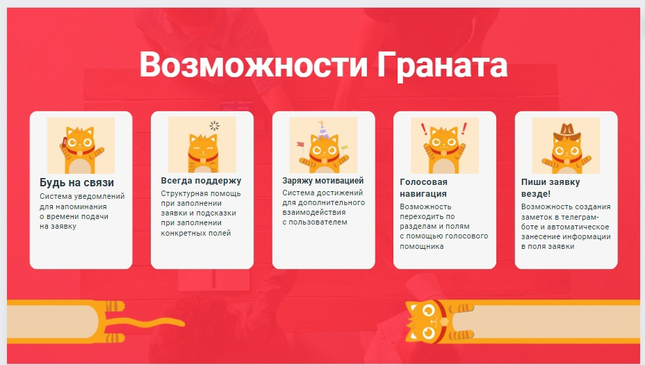

# Backend

## Реализованная функциональность

* Настроены мок запросы
* Чат на WebSocket
* Granat - голосовой помощник
* Auto deploy

## Стек
### Frontend
* React
* Typescript
* Docker, Docker-compose

### Backend
* Python, FastAPI
* PostgreSQL, SQLAlchemy
* Websockets
* Docker, Docker-compose

## Особенности проекта

## Авторы кода

|          |      |   |
|--------------|-----------|------------|
| Андрей Баранов | Backend     | [@AndyK_S](https://t.me/AndyK_S)      |
| Никита Баранов      | Backend/Design  | [@nick8ram](https://vk.com/nick8ram)       |
| Кристина Касьян     | Frontend  | [@kasyan_kristina](https://vk.com/kasyan_kristina)       |
| Роман Самофалов     | Frontend  | [@webdevk4](https://vk.com/webdevk4)       |